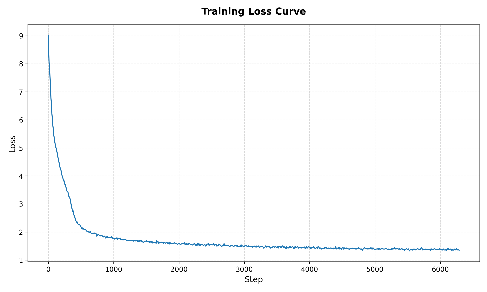

# GradCraft Autograd Engine.

A custom C++ Deep Learning framework built entirely from scratch. It doesn't rely on any other framework.

`GradCraft` consists of an autograd engine, memory pools (for both `CPU` and `CUDA`), tons of math and algos (tons is an understatement honestly), and handwritten kernels. 

It reaches **45-50%** eager `PyTorch` speed while training a 180 000 000 param GPT under the same conditions (no `FlashAttention`, `fp32`).  
More benchmarks are in [BENCHMARK.md](BENCHMARK.md)

## Contents
- [A few words about the engine](#a-few-words-about-the-engine-itself)
- [Documentation (it exists)](#documentation-i-actually-wrote-it)
- [Slop-generating LLM in GradCraft!!!](#a-working-clanker-trained-in-gradcraft)
- [MALLMOC Training run](#mallmoc-training-run)
- [Running it on your machine](#running-it-on-your-machine)
  - [Prerequisites](#step-0-prerequisites)
  - [Build](#step-1-binaries)
  - [Tokenize](#step-2-tokenizing)
  - [Train](#step-3-training)
  - [Inference](#step-4-inference)

## A Few Words About the Engine Itself.

Building `GradCraft` was brutal but rewarding. It's built for hardware efficiency. More in-detail deep dive into architecture is in [ARCHITECTURE.md](ARCHITECTURE.md)

Really shortly:
* GradCraft is lazily-evaluated. This means you first build the graph, and then call `.realize()`.
* After doing so, you can call `.backward()` to get all gradients computed (if `Tensors` require them).
* Core classes are `Storage`, `TensorState`, `Tensor` and `Node` to build the graph and dispatch calculations.
* It works both on the `CPU` and `CUDA`.
* There are custom memory pools so that no repeated `cudaMalloc` or `cudaFree` is called during a training loop.
* Dispatchers route math to either `CPU` or `CUDA` so you can switch devices with just `.to(Device)`.
* Fused handwritten `CUDA` kernels to speed up bottlenecks (speedups from 2x to 100x)
* DL frontend such as `Optimizer`, `Module<T>` or `Parameter<T>`.
* Checkpointing training runs
* A batched BPE tokenizer with multi-threading
* ... and many more.

## Documentation (I actually wrote it).

As mentioned, there are two more files.
* [ARCHITECTURE.md](ARCHITECTURE.md): A technical deepdive into how the architecture parts interact (memory, core classes)
* [BENCHMARK.md](BENCHMARK.md): How fused kernels obliterate naive ones, comparison to PyTorch, etc.

## A Working Clanker Trained in GradCraft.
To prove the math holds up I trained a (90M) param LLM called **MALLMOC** (LLM + MALLOC = MALLMOC) in `GradCraft` on an RTX 3090. It is definitely NOT smart, but it is trained.  

### When it does not write slop:
`PROMPT:`
```py
def reverse_string(
```
`PROMPT + ANSWER:`
```py
def reverse_string(string: str):
    return ''.join(reversed(string))
```

`PROMPT:`
```py
def linear_search(arr, x):
```
`PROMPT + ANSWER:`
```py
def linear_search(arr, x):
    for i in range(len(arr)):
        if x == arr[i]:
            return i

    return -1
```

Trust me, it took a bit of prompting for it to shine with some correct code.

### When it writes slop:
This is way more entertaining.

`PROMPT:`
```py
def is_sunday
```
`PROMPT + ANSWER:`
```py
def is_sunday(sun):
    if not is_tuesday(sun):    # if is sunday, the day is not tuesday, not by the week number
        return False

    days = sun - sun
    weeks = weeks + 3
```

`PROMPT:`
```py
def fibonacci(n):
```
`PROMPT + ANSWER:`
```py
def fibonacci(n):

def fabonacci(n):
    if n < 4:   
        return 1
    
    return fibonacci(n-2)*n+fibonacci(n-1)
```
I love that it refused `fibonacci` and wrote `fabonacci`.

## MALLMOC Training run.
It made 6300 steps on an RTX 3090 with `B=512`. Loss drop: `9.01` -> `1.35`. Throughput: `~8650` tok/s.  
MALLMOC was trained on a part of the `python_edu` dataset.  
Weights are not in the repo. They are like `350MB`.  
  
  
  

---

# Running it on your machine.
> Important info for Windows: you must run build commands inside Developer Powershell `x64`. Standard `PowerShell` defaults to `32-bit`compiler tools, which up the `nvcc`.  
  
There are 3 executables: `tokenize.exe`, `train.exe` and `inference.exe`.

## Step 0: Prerequisites.

* **GPU:** NVIDIA GPU with Compute Capability 7.5+ (RTX 20/30/40 series, GTX 16 series, A100, T4)
* **Operating System:** Windows (MSVC host compiler required for NVCC)
* **Compiler:** Visual Studio 2022 (v17.5+) with C++23 support enabled
* **CUDA Toolkit:** 12.0+ (Tested on RTX 3090 / Compute Capability 8.6)
* **Dependencies:** `vcpkg` package manager with `openblas` and `openmp` installed

Install via `vcpkg`:
```cmd
vcpkg install openblas:x64-windows openmp:x64-windows
```

## Step 1: Binaries.
1. Open your x64 terminal in the project root directory.
2. Configure CMake in Release mode using Ninja (you have to pass the correct path to vcpkg):
```powershell
cmake -G "Ninja" -DCMAKE_BUILD_TYPE=Release -DCMAKE_TOOLCHAIN_FILE="C:/your/path/to/vcpkg/scripts/buildsystems/vcpkg.cmake" -B build
```
3. Compile all three executables (`tokenize`, `train`, `inference`):
```powershell
cmake --build build --target tokenize --target train --target inference
```
When it finishes, all three binaries will be sitting inside `build/`:
- `build/tokenize.exe`
- `build/train.exe`
- `build/inference.exe`

## Step 2: Tokenizing.

Before training the model, raw text files must be processed into a BPE vocabulary and encoded.


### 1. Move data:
Place all raw `.txt` files inside one directory (I will use `root/data/raw_data` which is default.)
```txt
GradCraft/
|--- data/
       |--- raw_data/
             |--- file1.txt
             |--- file2.txt
```

> Crucial: Don't cheap out on text. If total tokenized length <= seq_len + 1, it crashes. There must be enough data for at least one batch.

### 2. Run the Tokenizer

Run `tokenize.exe` with your target settings:

```powershell
.\build\tokenize.exe --data_dir ./data/raw_data --vocab_path ./data/vocab/vocab.bin --output_path ./data/datasets/dataset.bin --vocab_size 8192 --sample_mb 200
```

### 3. CLI for `tokenize.exe`:
| Flag | Description | Default |
| :--- | :--- | :--- |
| `--data_dir` | Directory containing raw `.txt` files | `./data/raw_data` |
| `--vocab_path` | Output path for generated BPE vocabulary | `./data/vocab/vocab.bin` |
| `--output_path` | Output path for encoded dataset binary | `./data/datasets/dataset.bin` |
| `--vocab_size` | Target BPE vocabulary size. Must be >= 260 | `8192` |
| `--sample_mb` | Maximum MB of text used to build vocabulary | `200` |

### 4. Generated Files:
- `vocab.bin`: Binary file storing BPE merge hierarchy and vocabulary map.
- `dataset.bin`: All files in `data_dir` concatenated and encoded in `uint32` ready for training.

## Step 3: Training.

Once the dataset is tokenized, launch `train.exe` to train the model (in this case its an LLM) or to resume if your PC blew up mid-training.

> Crucial: The `--vocab_size` specified during training **must match** the vocabulary size used when tokenizing your dataset in Step 2. If you generated your dataset with `--vocab_size 8192`, make sure you pass `--vocab_size 8192` in `train.exe` too.

### 1. Run the Training.

Run `train.exe` using your target dataset, output directory, desired model architecture and training hyperparams:

```powershell
.\build\train.exe --dataset ./data/datasets/dataset.bin --model_dir ./models/mallmoc --steps 6300 --vocab_size 8192 --seq_len 512 --embed_dim 768 --num_heads 12 --num_layers 11 --batch_size 16 --target_batch 512 --max_lr 0.0006 --min_lr 0.00006 --beta1 0.9 --beta2 0.95 --print_every 10 --checkpoint_every 500
```

### 2. Resuming a Run

If your training crashed, you can use the `--resume` flag to start off from the latest saved checkpoint.

```powershell
.\build\train.exe [same args as above (crucial)] --resume
```

### 3. CLI for `train.exe`:

| Flag | Description | Default |
| :--- | :--- | :--- |
| `--dataset` | Path to the encoded dataset binary | `./data/datasets/dataset.bin` |
| `--model_dir` | Output directory for checkpoints, config, trained weights | `./models/mallmoc` |
| `--steps` | Total training steps | `6300` |
| `--resume` | Resume training from the latest checkpoint in `--model_dir` | `false` |
| `--vocab_size` | Vocabulary size (must match Step 2) | `8192` |
| `--seq_len` | Context window | `512` |
| `--embed_dim` | Embedding dimension | `768` |
| `--num_heads` | Number of attention heads | `12` |
| `--num_layers` | Number of transformer blocks | `11` |
| `--batch_size` | Physical micro-batch size processed at once | `16` |
| `--target_batch` | Target batch size for gradient accumulation | `512` |
| `--max_lr` | Peak LR for CosineScheduler | `0.0006` |
| `--min_lr` | Minimum learning rate for CosineScheduler | `0.00006` |
| `--beta1` | AdamW beta1 param | `0.9` |
| `--beta2` | AdamW beta2 param | `0.95` |
| `--print_every` | Step interval for printing and CSV log | `10` |
| `--checkpoint_every` | How often a checkpoint is made | `500` |

*Note: with default settings, you will train a 90M model. The same one as me. They are optimal for a 90M model. It is what trained this beautiful clanker that you've just seen generate slop.*

### 4. Generated Files:

- `model_dir/config.bin`: Serialized model architecture (so you dont have to specify everything when running `inference.exe`)
- `model_dir/trained_model.bin`: Final trained model weights
- `model_dir/latest_model.bin`: Latest weight checkpoint
- `model_dir/latest_optim.bin`: Latest AdamW checkpoint
- `model_dir/latest_scheduler.bin`: Latest CosineScheduler checkpoint
- `model_dir/training_log.csv`: Step/Loss/Norm/LR log file

## Step 4: Inference.

Once you have a trained model, you can run inference! yay

### 1. Required Files:

To run `inference.exe`, you need these 3 files you acquired along the way:
1. `vocab.bin`: Generated during Step 2 (`tokenize.exe`)
2. `config.bin`: Automatically saved in `--model_dir` during Step 3 (`train.exe`)
3. `trained_model.bin` or `latest_model.bin`: Saved during or after the training has finished.

### 2. Run Inference

Run `inference.exe`. The script launches a session where you can prompt the model however many times you want.

```powershell
.\build\inference.exe --vocab ./data/vocab/vocab.bin --config ./models/mallmoc/config.bin --weights ./models/mallmoc/trained_model.bin --max_tokens 256 --temp 1.0 --top_k 20
```

### 3. CLI for `inference.exe`

| Flag | Description | Default |
| :--- | :--- | :--- |
| `--vocab` | Path to the BPE vocabulary file | `./data/vocab/vocab.bin` |
| `--config` | Path to model architecture config (`config.bin`) | `./models/mallmoc/config.bin` |
| `--weights` | Path to model weights binary (`trained_model.bin` or `latest_model.bin`) | `./models/mallmoc/trained_model.bin` |
| `--max_tokens` | Maximum number of tokens generated per prompt | `512` |
| `--temp` | Temperature for sampling (not passing means using `argmax`) | Unset (`argmax`) |
| `--top_k` | Top-K sampling | 20 |

# That is GradCraft. Thanks for reading! :)
